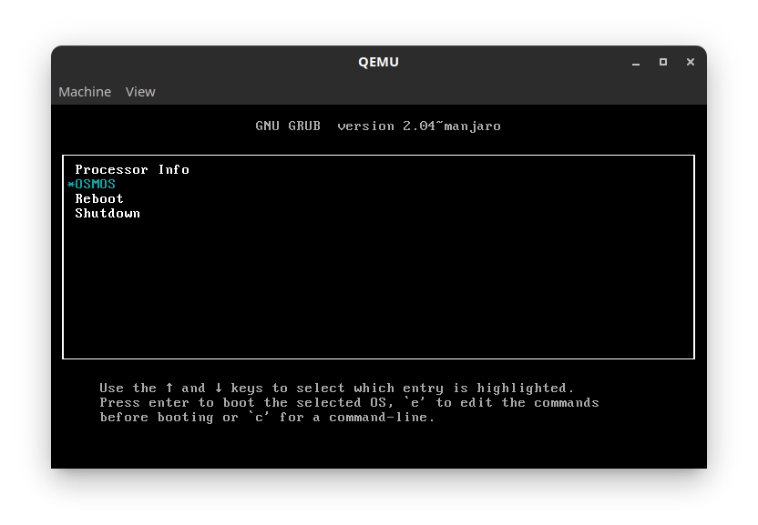
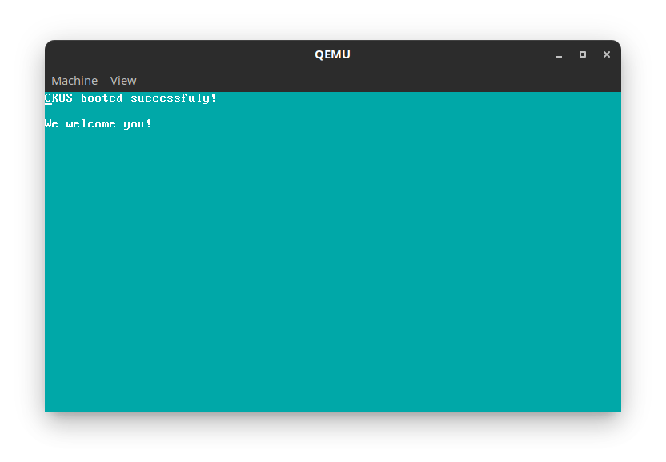

# CKOS
<h3 align="center">CKOS</h3>
Hello! I am making a simple kernel in C. This is one of my first projects so it isn't perfect, I know.
If you want to help, feel free to contact me at oe12@protonmail.com. Please no spam though.

If you like this code, feel free to use if for any project! Enjoy :)

Screenshots:

Sources:

 https://www.codeproject.com/Articles/1225196/Create-Your-Own-Kernel-In-C-2
